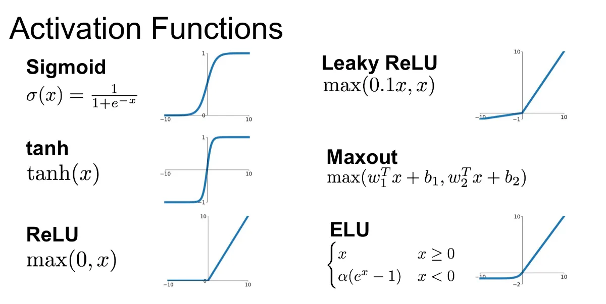

# Loss Function

A **loss function** is a mathematical function that quantifies the difference between the predicted output of a model and the actual target value. It serves as a guide for optimizing the model by adjusting parameters to minimize this error.

## Types of Loss Functions

### 1. **Mean Squared Error (MSE)**
Used for regression problems, MSE calculates the average squared difference between actual and predicted values.

$$
\text{MSE} = \frac{1}{n} \sum_{i=1}^{n} (y_i - \hat{y}_i)^2
$$

where:
- $ y_i $ is the actual value
- $ \hat{y}_i $ is the predicted value
- $ n $ is the number of samples

### 2. **Mean Absolute Error (MAE)**
Instead of squaring the errors, MAE takes the absolute difference.

$$
\text{MAE} = \frac{1}{n} \sum_{i=1}^{n} |y_i - \hat{y}_i|
$$

### 3. **Huber Loss**
Huber loss is a combination of MSE and MAE, making it robust to outliers.

$$
L_{\delta}(a) =
\begin{cases} 
\frac{1}{2} a^2 & \text{for } |a| \leq \delta \\
\delta (|a| - \frac{1}{2} \delta) & \text{for } |a| > \delta
\end{cases}
$$

where $ a = y_i - \hat{y}_i $.

### 4. **Log-Cosh Loss**
Similar to Huber loss, log-cosh is smooth and less sensitive to outliers.

$$
\text{Log-Cosh} = \sum_{i=1}^{n} \log (\cosh(y_i - \hat{y}_i))
$$

### 5. **Binary Cross-Entropy (Log Loss)**
Used for binary classification, measures the difference between two probability distributions.

$$
\text{BCE} = -\frac{1}{n} \sum_{i=1}^{n} \left[ y_i \log(\hat{y}_i) + (1 - y_i) \log(1 - \hat{y}_i) \right]
$$

### 6. **Categorical Cross-Entropy**
Used for multi-class classification with one-hot encoded labels.

$$
\text{CCE} = -\sum_{i=1}^{n} \sum_{j=1}^{k} y_{ij} \log (\hat{y}_{ij})
$$

where:
- $ k $ is the number of classes
- $ y_{ij} $ is 1 if the sample $ i $ belongs to class $ j $, otherwise 0

### 7. **Kullback-Leibler (KL) Divergence**
Measures the difference between two probability distributions.

$$
D_{\text{KL}}(P || Q) = \sum_{i} P(i) \log \frac{P(i)}{Q(i)}
$$

where $ P(i) $ is the true distribution and $ Q(i) $ is the predicted distribution.

These loss functions are essential in machine learning for optimizing models based on the problem type.

# Activation Functions

An **activation function** is a mathematical function applied to the output of a neuron in an artificial neural network. It determines whether a neuron should be activated based on its input, allowing the network to learn complex patterns.

## Types of Activation Functions

### 1. **Linear Activation Function**
A simple function where the output is proportional to the input.

$$
f(x) = ax
$$

- Used in regression tasks.
- Cannot introduce non-linearity, making deep networks ineffective.

### 2. **Sigmoid Activation Function**
A nonlinear function that maps any input to a range between 0 and 1.

$$
\sigma(x) = \frac{1}{1 + e^{-x}}
$$

- Used in binary classification.
- Prone to **vanishing gradient** problem.

### 3. **Hyperbolic Tangent (Tanh)**
Similar to the sigmoid but outputs values in the range $[-1,1]$.

$$
\tanh(x) = \frac{e^x - e^{-x}}{e^x + e^{-x}}
$$

- Zero-centered, making optimization easier than sigmoid.
- Also suffers from **vanishing gradient**.

### 4. **Rectified Linear Unit (ReLU)**
The most commonly used activation function in deep learning.

$$
\text{ReLU}(x) = \max(0, x)
$$

- Solves the vanishing gradient problem for positive values.
- Can suffer from the **dying ReLU** problem (neurons stuck at 0).

### 5. **Leaky ReLU**
A modification of ReLU that allows small gradients for negative inputs.

$$
\text{LeakyReLU}(x) =
\begin{cases} 
x & \text{if } x \geq 0 \\
\alpha x & \text{if } x < 0
\end{cases}
$$

where $ \alpha $ is a small constant (e.g., 0.01).

- Solves the **dying ReLU** problem.

### 6. **Exponential Linear Unit (ELU)**
An improved ReLU variant that smooths the transition for negative inputs.

$$
\text{ELU}(x) =
\begin{cases} 
x & \text{if } x \geq 0 \\
\alpha (e^x - 1) & \text{if } x < 0
\end{cases}
$$

- Avoids **dying ReLU** and vanishing gradient issues.

### 7. **Softmax Activation Function**
Used for multi-class classification, converts logits into probabilities.

$$
\text{Softmax}(x_i) = \frac{e^{x_i}}{\sum_{j} e^{x_j}}
$$

- Ensures output values sum to 1.

These activation functions play a crucial role in training deep neural networks and selecting the right one depends on the problem type.

# Benefits of Using Activation Functions and the Problems They Solve

## **1. Introducing Non-Linearity**
### **Problem: Linear Models are Limited**
Without activation functions, a neural network is just a linear function, no matter how many layers it has. This means it cannot model complex, nonlinear relationships.

### **Solution: Activation Functions Enable Non-Linearity**
Nonlinear activation functions (e.g., **ReLU, Sigmoid, Tanh**) allow neural networks to learn **complex patterns** and **approximate any function** (as guaranteed by the Universal Approximation Theorem).

---

## **2. Enabling Deep Learning**
### **Problem: Without Activation, Layers Collapse**
If every layer only performs linear transformations, stacking multiple layers is **equivalent to a single-layer model**.

### **Solution: Activation Functions Allow Layer Stacking**
By introducing non-linearity, each layer **extracts new features**, making deeper networks useful.

---

## **3. Controlling Gradient Flow (Avoiding Vanishing/Exploding Gradients)**
### **Problem: Vanishing Gradient**
- Sigmoid and Tanh saturate for large values (gradients become **very small**).
- This slows down training in **deep networks**.

### **Solution: ReLU and Variants (Leaky ReLU, ELU)**
- **ReLU** keeps gradients alive for positive values, avoiding saturation.
- **Leaky ReLU** and **ELU** solve the issue for negative values.

### **Problem: Exploding Gradient**
- Large gradients can cause instability in deep networks.

### **Solution: Normalization & Activation Choices**
- **Tanh** squashes values to \([-1, 1]\), preventing extreme values.
- **Batch Normalization** and **Gradient Clipping** help regulate gradients.

---

## **4. Enabling Probabilistic Outputs (Softmax & Sigmoid)**
### **Problem: Neural Networks Need to Output Probabilities**
- In classification tasks, raw outputs (logits) are unbounded.

### **Solution: Activation Functions Map Values to Probabilities**
- **Sigmoid** (for binary classification) ensures outputs are between **0 and 1**.
- **Softmax** (for multi-class classification) normalizes outputs to **sum to 1**.

---

## **5. Preventing Dead Neurons (Dying ReLU Problem)**
### **Problem: ReLU Neurons Can "Die"**
- If ReLU outputs **0** for all inputs, the neuron stops learning.

### **Solution: Leaky ReLU & ELU**
- **Leaky ReLU** allows small negative values to keep gradients flowing.

---

## **Conclusion**
Activation functions are essential in neural networks because they:
- **Enable deep learning** by introducing non-linearity.
- **Prevent vanishing/exploding gradients** for stable training.
- **Allow probability-based outputs** for classification tasks.
- **Solve neuron death problems** for efficient learning.

Choosing the right activation function is **crucial** for training efficiency and model performance.

# Universal Approximation Theorem

The **Universal Approximation Theorem (UAT)** states that a feedforward neural network with at least one hidden layer and a **sufficient number of neurons** can approximate any **continuous function** on a compact subset of $ \mathbb{R}^n $ to any desired degree of accuracy.

## **Mathematical Formulation**
Given a continuous function $ f: \mathbb{R}^n \to \mathbb{R} $, for any $ \epsilon > 0 $, there exists a neural network function $ F(x) $ with a single hidden layer such that:

$$
| F(x) - f(x) | < \epsilon, \quad \forall x \in \mathbb{R}^n
$$

where $ F(x) $ is defined as:

$$
F(x) = \sum_{i=1}^{m} w_i \sigma(W_i x + b_i)
$$

where:
- $ \sigma $ is a **nonlinear activation function** (e.g., Sigmoid, ReLU, Tanh).
- $ w_i $ and $ W_i $ are weights.
- $ b_i $ is a bias term.
- $ m $ is the number of hidden neurons.

## **Key Insights**
1. **Single-Layer Sufficiency**: A **single hidden layer** is theoretically enough to approximate any function, but it may require an **exponentially large number of neurons**.
2. **Choice of Activation Function**: The theorem holds for **nonlinear, bounded, and continuous** activation functions (e.g., Sigmoid, Tanh).
3. **Practical Limitations**:
   - The theorem does not guarantee **efficient** learning.
   - Deep networks with **multiple hidden layers** often perform better in practice due to improved parameter efficiency.

## **Conclusion**
While the UAT guarantees that neural networks can approximate any function, it does **not** imply that they will learn effectively. Optimization techniques, architectures, and deeper networks are often needed for practical performance.
