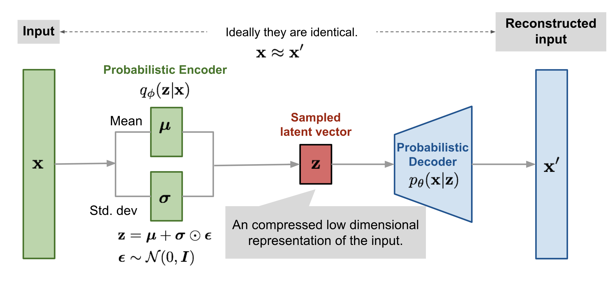

# Latent Variable Model (LVM)

## **Definition**
A **Latent Variable Model (LVM)** is a statistical model that introduces **hidden (latent) variables** that are not directly observed but influence the observed data. These models are used to explain complex dependencies and structures in data.

Mathematically, LVMs assume that observed data $ X $ is generated from some latent variable $ Z $ through a probabilistic process:

$$ P(X) = \int P(X | Z) P(Z) dZ $$

Where:
- $ P(Z) $ is the **prior distribution** over the latent variable.
- $ P(X | Z) $ is the **likelihood function** (how $ X $ is generated from $ Z $).
- The integral marginalizes over the latent variable.

---
# **KL Divergence (Kullback-Leibler Divergence)**

## **Definition**
KL divergence is a measure of how one probability distribution differs from another. It is **not symmetric**, meaning that:

$$ D_{KL}(P || Q) \neq D_{KL}(Q || P) $$

The KL divergence from distribution $ P(X) $ (true distribution) to $ Q(X) $ (approximate distribution) is given by:

$$ D_{KL}(P || Q) = \sum_x P(x) \log \frac{P(x)}{Q(x)} $$

Or in the continuous case:

$$ D_{KL}(P || Q) = \int P(x) \log \frac{P(x)}{Q(x)} dx $$

Where:
- $ P(x) $ is the **true distribution**.
- $ Q(x) $ is the **approximate distribution**.

KL divergence is always **non-negative**:

$$ D_{KL}(P || Q) \geq 0 $$

and is **zero only if** $ P = Q $.

---

## **Forward KL Divergence (Zero-Avoiding)**
### **Definition:**
$$ D_{KL}(P || Q) = \sum_x P(x) \log \frac{P(x)}{Q(x)} $$

- **Minimizing** $ D_{KL}(P || Q) $ forces $ Q(x) $ to cover **all modes** of $ P(x) $.
- If $ Q(x) $ assigns **zero probability** to any region where $ P(x) > 0 $, the KL divergence **goes to infinity**.
- **Result:** The approximate distribution $ Q(x) $ **avoids assigning zero probability** where $ P(x) $ has mass → "zero-avoiding."
- **Used in Variational Inference (VI).**

---

## **Reverse KL Divergence (Zero-Forcing)**
### **Definition:**
$$ D_{KL}(Q || P) = \sum_x Q(x) \log \frac{Q(x)}{P(x)} $$

- **Minimizing** $ D_{KL}(Q || P) $ forces $ Q(x) $ to **only** focus on the **high-probability** regions of $ P(x) $.
- If $ Q(x) $ has high probability in regions where $ P(x) $ is low, this KL divergence becomes large.
- **Result:** $ Q(x) $ concentrates on a **single mode** of $ P(x) $, ignoring less likely regions → "zero-forcing."
- **Used in Expectation-Maximization (EM) algorithms.**

---

# **Variational Inference (VI)**

## **Definition**
Variational Inference is an optimization-based technique for approximating complex probability distributions. Instead of sampling, it **optimizes an approximate distribution** $ Q(Z) $ to be as close as possible to the true posterior $ P(Z | X) $.

Given **Bayes’ theorem**:

$$ P(Z | X) = \frac{P(X | Z) P(Z)}{P(X)} $$

where $ P(X) $ is intractable, we approximate $ P(Z | X) $ with a simpler $ Q(Z) $ by minimizing the KL divergence:

$$ D_{KL}(Q(Z) || P(Z | X)) $$

---

# **Variational Autoencoder (VAE)**

## **Definition**
A Variational Autoencoder (VAE) is a generative model that learns a **latent representation** of data by optimizing a **variational lower bound**. It consists of:
1. **Encoder**: Maps input $ X $ to a latent distribution $ Q(Z | X) $.
2. **Decoder**: Generates $ X $ from latent samples $ Z $.
3. **Latent Space Regularization**: Imposes a prior on $ Z $ (typically $ Z \sim \mathcal{N}(0, I) $).

---

# **Variational Lower Bound (ELBO)**
Since the true likelihood $ P(X) $ is intractable, we derive a **lower bound** to optimize:

$$ \log P(X) = D_{KL}(Q(Z | X) || P(Z | X)) + \mathcal{L}(X, Z) $$

Since $ D_{KL}(\cdot) \geq 0 $, we get the **Evidence Lower Bound (ELBO):**

$$ \mathcal{L}(X, Z) = \mathbb{E}_{Q(Z | X)} [\log P(X | Z)] - D_{KL}(Q(Z | X) || P(Z)) $$

Where:
- $ \mathbb{E}_{Q(Z | X)} [\log P(X | Z)] $ = **Reconstruction loss** (ensures generated samples match input).
- $ D_{KL}(Q(Z | X) || P(Z)) $ = **Regularization loss** (ensures latent space follows prior distribution).

---

# **Amortized Variational Inference**
## **Definition**
Instead of optimizing a separate $ Q(Z | X) $ for each data point, **Amortized Inference** learns a **single function** $ Q(Z | X; \theta) $ to predict the variational posterior for any input.

### **Benefits:**
- **Faster Inference**: A neural network encodes all inputs into latent space efficiently.
- **Reduced Computation**: No need to optimize $ Q(Z | X) $ separately for each datapoint.

### **Example:**
In VAEs, the **encoder network** parameterizes $ Q(Z | X) $ using deep neural networks instead of explicitly computing it.

---

# **Conditional Variational Autoencoder (CVAE)**

## **Definition**
A **Conditional Variational Autoencoder (CVAE)** is an extension of the **Variational Autoencoder (VAE)** that incorporates **extra conditioning information** (e.g., labels, attributes) into the encoding and decoding process. This allows the model to **generate specific outputs** based on the given condition.

---

## **Mathematical Formulation**
In a standard **VAE**, we learn the latent distribution \( Z \) given data \( X \):

$$ P(Z | X) \approx Q(Z | X) $$

In **CVAE**, we introduce a **condition** \( C \), so the latent distribution and generation process become:

$$ P(Z | X, C) \approx Q(Z | X, C) $$

Thus, the generative model now learns:

$$ P(X | Z, C) $$

The **ELBO (Evidence Lower Bound)** for CVAE is:

$$ \mathcal{L}(X, Z | C) = \mathbb{E}_{Q(Z | X, C)} [\log P(X | Z, C)] - D_{KL}(Q(Z | X, C) || P(Z | C)) $$

Where:
- \( P(Z | C) \) is a **prior** that depends on \( C \).
- \( Q(Z | X, C) \) is the **encoder**.
- \( P(X | Z, C) \) is the **decoder**.
- \( D_{KL} \) ensures the latent space is structured according to the prior.

---

## **CVAE Architecture**
A CVAE consists of:

1. **Encoder** \( Q(Z | X, C) \): 
   - Maps \( (X, C) \) to a latent distribution \( Z \).
   - Outputs mean and variance of \( Z \).
  
2. **Decoder** \( P(X | Z, C) \):
   - Takes \( (Z, C) \) as input and reconstructs \( X \).

3. **Latent Prior** \( P(Z | C) \):
   - Ensures that the latent space respects the given condition.

---

## **Key Differences Between VAE and CVAE**
| Feature          | VAE                               | CVAE                          |
|-----------------|--------------------------------|--------------------------------|
| **Conditioning** | No conditioning (unsupervised) | Uses additional conditions \( C \) |
| **Latent Prior** | \( P(Z) \sim \mathcal{N}(0, I) \) | \( P(Z | C) \) (condition-dependent) |
| **Sampling** | \( X \sim P(X | Z) \) | \( X \sim P(X | Z, C) \) |
| **Application** | General generative modeling | Controlled generation based on conditions |

---

## **Applications of CVAE**
1. **Image Generation** (e.g., generating faces based on attributes like age, gender).
2. **Text-to-Image Synthesis** (e.g., generating images from text descriptions).
3. **Speech Synthesis** (e.g., generating audio conditioned on speaker identity).
4. **Data Imputation** (e.g., filling in missing values based on context).
5. **Style Transfer** (e.g., generating different artistic styles of an image).

---

## **Example: CVAE for Handwritten Digits**
If we train a **CVAE** on MNIST digits with labels \( C = \text{digit class} \), we can generate digits **conditioned on the class**. 

For example, given \( C = 7 \), the CVAE will generate images of the digit **7**.

---

## **Conclusion**
CVAE enhances the traditional VAE by enabling **controlled generation** using external conditions. This makes it useful for applications requiring structured and targeted output generation.
