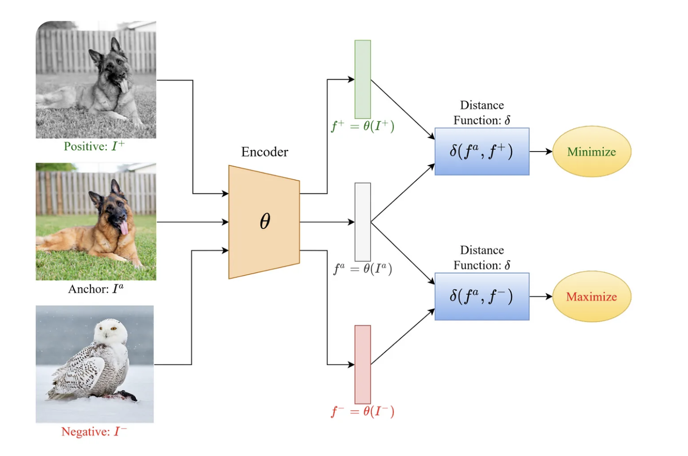

## CLIP
CLIP (Contrastive Language-Image Pretraining) is a model developed by OpenAI that can understand images and text together. It was trained on a large dataset of images paired with descriptions from the internet. The key idea behind CLIP is **contrastive learning**, where the model learns to associate images with their corresponding text by distinguishing between correct and incorrect matches.

### How CLIP Works:
1. **Two Encoders**: CLIP consists of two neural networks:
   - An **image encoder** (typically based on Vision Transformers or CNNs) processes images.
   - A **text encoder** (based on Transformer architectures like GPT) processes text.

2. **Contrastive Learning**: During training, CLIP learns to bring the correct image-text pairs closer together in a shared embedding space while pushing incorrect pairs apart.

3. **Zero-Shot Learning**: Since CLIP is trained on diverse image-text data, it can perform tasks without additional fine-tuning. For example, given an image, it can match it with the most relevant text description even if it has never seen that specific image before.

### Applications of CLIP:
- **Image classification without labeled data** (zero-shot classification)
- **Text-to-image search** (retrieving images based on text queries)
- **Generating text descriptions for images** (when combined with other models)
- **Improving vision-language models** (e.g., multimodal AI applications)
